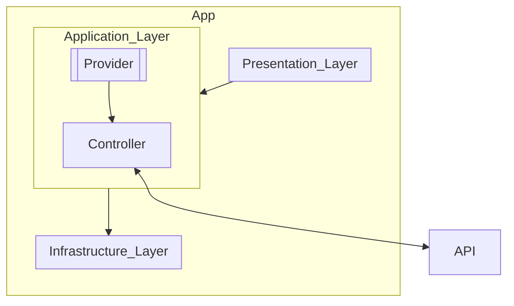

# 全体

```mermaid
graph TD
    subgraph App
        subgraph Presentation_Layer
        end

        subgraph Application_Layer
            Controller
            Provider[["Provider"]]
        end

        subgraph Infrastructure_Layer
        end

    end

    API

    Presentation_Layer --> Application_Layer
    Application_Layer --> Infrastructure_Layer
    Controller <--> API
    Provider --> Controller
```
