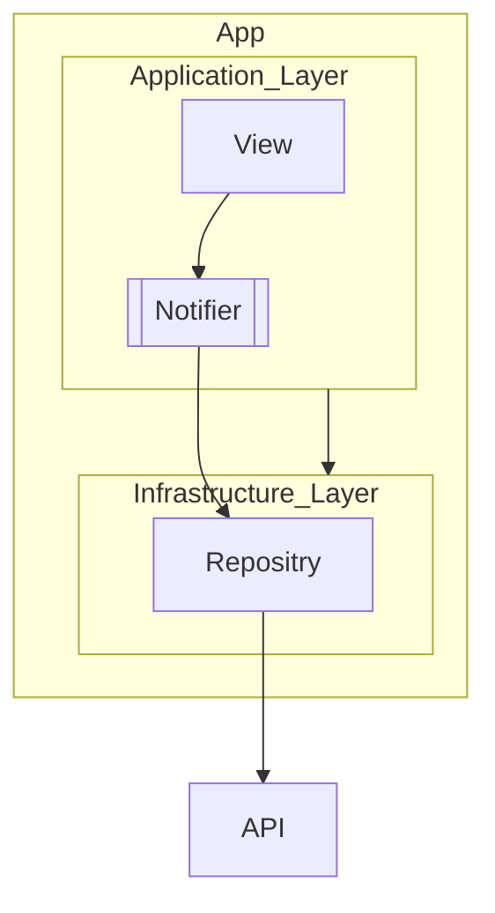

# 全体

```mermaid
graph TD
    subgraph App
        subgraph Application_Layer
            View
            Notifier[["Notifier"]]
        end

        subgraph Infrastructure_Layer
            Repositry
        end


    end

    API
    Application_Layer --> Infrastructure_Layer
    View --> Notifier
    Notifier --> Repositry
    Repositry --> API
```
